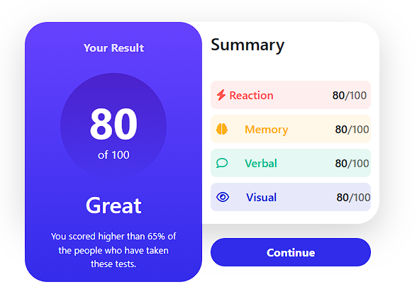

# Results Summary - Bootstrap Practice

## Descripción
Este es un proyecto de práctica en frontend que replica el diseño de una página dada como referencia. Se ha desarrollado utilizando HTML, CSS y Bootstrap para mejorar habilidades en diseño responsivo y maquetación moderna.

## Tecnologías utilizadas
- **HTML5**: Estructura semántica del contenido.
- **CSS3**: Estilos y personalización visual.
- **Bootstrap 5**: Framework CSS para diseño responsivo y componentes.
- **FontAwesome**: Iconos para mejorar la interfaz.
- **Google Fonts**: Tipografía para mejorar el diseño visual.

## Características principales
- Diseño responsivo adaptable a diferentes dispositivos.
- Uso de Bootstrap Grid System para la organización de los elementos.
- Componentes estilizados con Bootstrap y CSS personalizado.
- Integración de iconos FontAwesome.

## Instalación y uso
1. Clonar el repositorio:
   ```bash
   git clone https://github.com/tu-usuario/nombre-del-repositorio.git
2. Abrir el archivo index.html en un navegador web.

## Captura de pantalla


## Autor
Juan Esteban Gay Garavito - GitHub

Este proyecto fue desarrollado como parte de una práctica de frontend con Bootstrap.